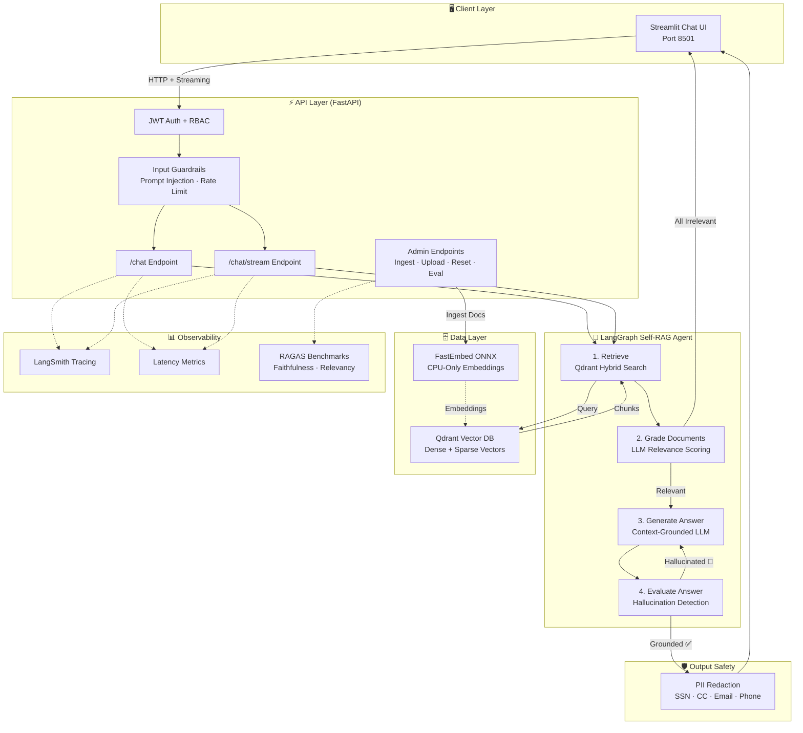
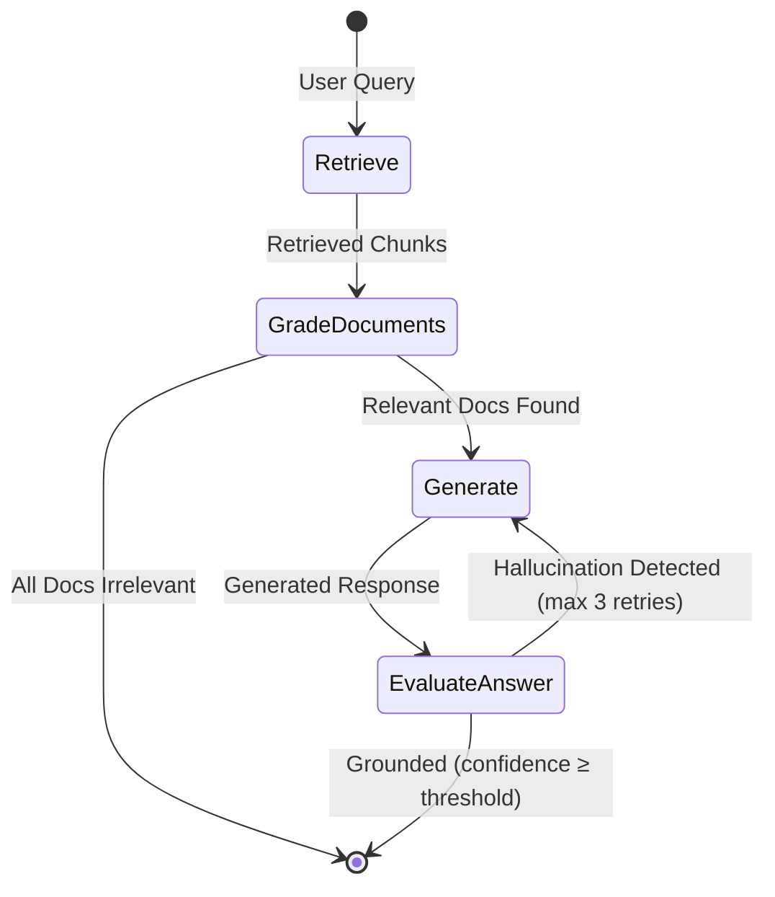

# Support Docs Copilot

[](https://huggingface.co/spaces/vineet88/support-docs-copilot)

A lightweight, production-ready advanced RAG support copilot using OpenRouter free LLM APIs (`google/gemma-4-31b-it:free`), Qdrant dense retrieval, FastEmbed CPU-only embeddings, LangGraph Self-RAG, Guardrails AI, Ragas evaluation, FastAPI, and Streamlit.

## 🧩 Tech Stack


---

## 🏗️ System Architecture



### Self-RAG Workflow (Cyclic Decision Graph)



## 🌟 Why Scenario B? (Lightweight & Cloud-Ready)
This project has been optimized to remove all heavy GPU and PyTorch/Ollama dependencies:
- **No Multi-GB Downloads:** Uses OpenRouter API for LLM inference, removing the need for local Ollama weights.
- **Lightweight Embeddings:** Employs ONNX-based `FastEmbed` for fast CPU-only vector embeddings without PyTorch bloat.
- **Free Tier Deployment Ready:** Small Docker image footprint (`~60% smaller`), easily deployable on free hosting tiers like Render, Railway, or Fly.io.

---

## 🚀 How to Run the Project

You can run this project in two ways: **Option A (Docker Compose - Easiest)** or **Option B (Local Python Environment)**.

### Option A: Running with Docker Compose (Recommended)

1. **Verify Environment Variables:**
   Make sure your `.env` file exists in the root directory and contains your OpenRouter API key:
   ```env
   OPENROUTER_API_KEY=your_openrouter_api_key_here
   OPENROUTER_BASE_URL=https://openrouter.ai/api/v1
   LLM_MODEL=google/gemma-4-31b-it:free
   RETRIEVAL_MODE=dense
   RERANKER_ENABLED=false
   ```

2. **Build and Start the Cluster:**
   ```bash
   docker-compose up --build -d
   ```
   *Or using Make:*
   ```bash
   make build
   make up
   ```

3. **Ingest the Sample Documentation:**
   Once the backend container is running, ingest the knowledge base documents into Qdrant:
   ```bash
   docker exec -it $(docker-compose ps -q backend) python -m app.engine.ingestion ingest
   ```
   *Or using Make:*
   ```bash
   make ingest
   ```

4. **Access the Application:**
   - 💬 **Streamlit Chat UI:** Open [http://localhost:8501](http://localhost:8501) in your browser.
   - ⚡ **FastAPI Backend & Swagger Docs:** Open [http://localhost:8000/docs](http://localhost:8000/docs).
   - 🗄️ **Qdrant Dashboard:** Open [http://localhost:6333/dashboard](http://localhost:6333/dashboard).

---

### Option B: Running Locally with Python (Without Docker)

If you prefer to run directly on your machine:

1. **Start Qdrant Vector Database:**
   You can either start Qdrant via Docker (`docker run -p 6333:6333 qdrant/qdrant`) or configure `QDRANT_LOCATION=./qdrant_data` in `.env` to use local disk storage automatically.

2. **Activate Virtual Environment & Install Dependencies:**
   ```bash
   python -m venv venv
   venv\Scripts\activate      # On Windows
   # source venv/bin/activate # On macOS/Linux
   pip install -r requirements.txt
   ```

3. **Ingest Sample Documents:**
   ```bash
   python -m app.engine.ingestion ingest
   ```

4. **Start the Backend API Server:**
   In your first terminal:
   ```bash
   uvicorn app.main:app --reload --port 8000
   ```

5. **Start the Streamlit Frontend UI:**
   In a second terminal (with virtual environment activated):
   ```bash
   streamlit run ui/app.py
   ```

---

## 🛠️ Makefile Commands

```bash
make build   # Build lightweight Docker images
make up      # Start Qdrant, Backend API, and Streamlit Frontend
make ingest  # Ingest documentation into Qdrant inside the container
make test    # Run pytest test suite inside the container
make eval    # Run RAGAS evaluation against golden dataset
make logs    # View live cluster logs
make down    # Tear down cluster and free ports
```

## 🔐 Authentication & Guardrails

- **JWT Authentication:** Protected endpoints require OAuth2 Bearer Tokens. Authenticate via `/auth/login` (default roles: `user` and `admin`).
- **Input Guardrails:** Automatically checks for prompt injection and applies rate limiting (30 req/min).
- **Output Guardrails:** Automatically scrubs and redacts PII (SSNs, credit card numbers) before returning answers to the UI.
