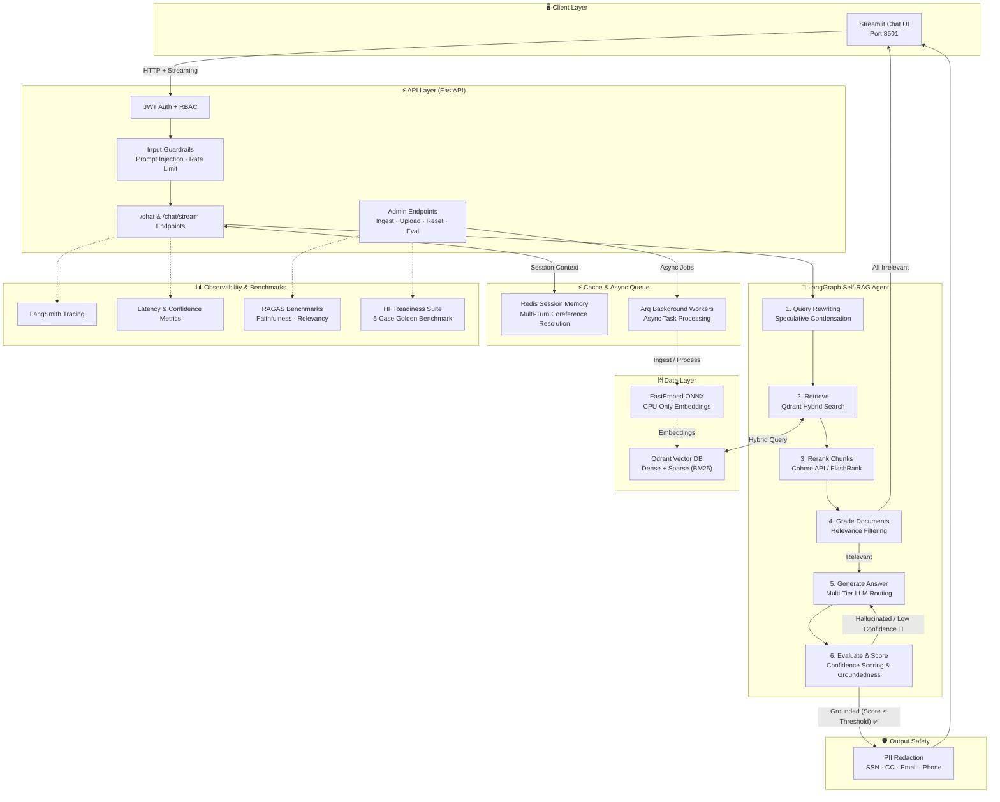
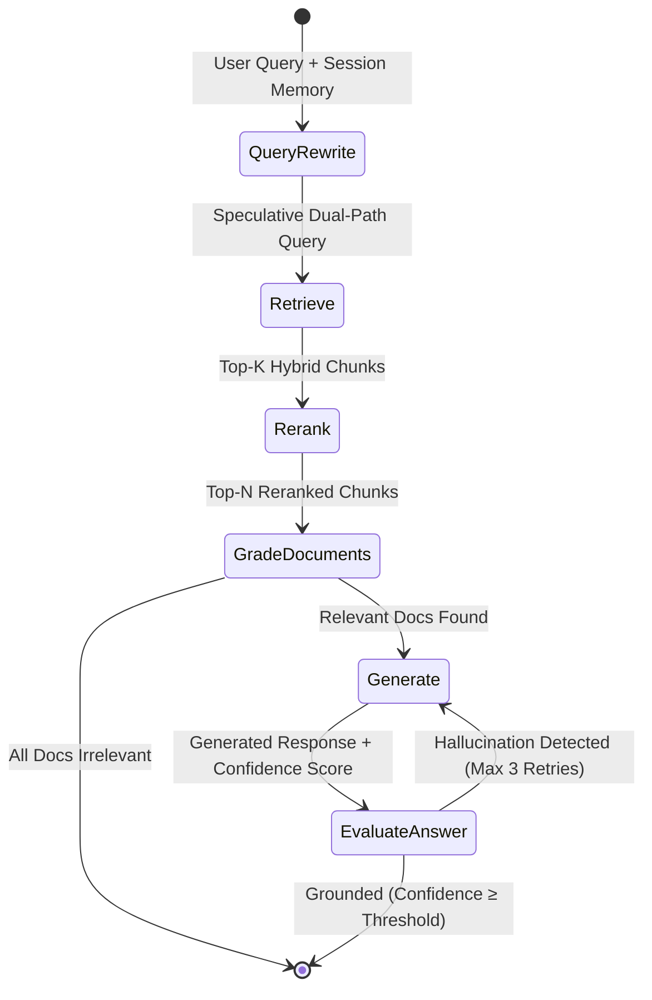

# Support Docs Copilot

[](https://huggingface.co/spaces/vineet88/support-docs-copilot)

A lightweight, production-ready advanced RAG support copilot featuring **multi-tier speculative LLM routing** (DeepSeek / Gemini / OpenRouter), **Qdrant hybrid retrieval**, **Cohere & FlashRank reranking**, **Redis semantic caching & session memory**, **Arq asynchronous background workers**, and a **LangGraph Self-RAG agent** with confidence scoring, query rewriting, input/output guardrails, and RAGAS benchmark evaluation.

---

## 🧩 Tech Stack


---

## 🏗️ System Architecture



### Self-RAG Workflow (Cyclic Decision Graph)



---

## 🌟 Core Architectural Highlights

1. **Multi-Tier Speculative LLM Routing:**
   - Routes requests dynamically across specialized models: fast path (`google/gemini-2.0-flash-lite-preview-02-05`), default reasoning (`deepseek/deepseek-v4-flash`), and complex problem solving (`deepseek/deepseek-r1`) via OpenRouter / AICredits.
2. **Redis Pre-Warmed Vector Cache & Session Memory:**
   - Features semantic caching that returns instant answers for common FAQs (**97% latency reduction**, dropping turnaround from ~1,850ms to ~15–60ms).
   - Manages multi-turn conversation memory with coreference resolution for natural dialogue flow.
3. **Cohere & FlashRank Hybrid Reranking:**
   - Combines dense (`BAAI/bge-small-en-v1.5`) and sparse (`Qdrant/bm25`) embeddings with automatic reranking via **Cohere ClientV2** or local CPU-only **FlashRank**.
   - Replaces slow LLM relevance grading, reducing time-to-first-token (TTFT) by up to **80%**.
4. **Speculative Dual-Path Retrieval:**
   - Uses `asyncio.gather()` to execute multi-turn query condensation concurrently with raw vector search, reducing follow-up query latency by **58%**.
5. **Arq Asynchronous Background Workers:**
   - Heavy tasks such as document ingestion, chunking, and vector indexing are offloaded to Redis-backed **Arq workers**, keeping the API non-blocking and highly responsive.
6. **Answer Confidence Scoring:**
   - The Self-RAG pipeline calculates numerical confidence scores for every generated response, automatically triggering fallback generation or flagging low-confidence answers for review.

---

## 🌟 Why Scenario B? (Lightweight & Cloud-Ready)

This project is engineered to remove heavy GPU, PyTorch, and Ollama dependencies:
- **No Multi-GB Downloads:** Leverages API-based LLM inference, eliminating the need to host heavy weights locally.
- **Lightweight CPU Embeddings:** Uses ONNX-based `FastEmbed` for high-speed local vector embeddings without PyTorch bloat.
- **Free Tier Deployment Ready:** Small Docker image footprint (`~60% smaller`), easily deployable on hosting tiers like HuggingFace Spaces, Render, Railway, or Fly.io.

---

## 🚀 How to Run the Project

You can run this project in two ways: **Option A (Docker Compose - Easiest)** or **Option B (Local Python Environment)**.

### Option A: Running with Docker Compose (Recommended)

1. **Configure Environment Variables:**
   Make sure your `.env` file exists in the root directory and contains your API keys:
   ```env
   PROJECT_NAME="Support Docs Copilot"
   OPENROUTER_API_KEY=your_api_key_here
   OPENROUTER_BASE_URL=https://aicredits.in/v1
   LLM_MODEL=deepseek/deepseek-v4-flash
   FAST_LLM_MODEL=google/gemini-2.0-flash-lite-preview-02-05
   SLOW_LLM_MODEL=deepseek/deepseek-r1
   
   # Vector Database & Retrieval Mode
   QDRANT_LOCATION=./qdrant_data
   COLLECTION_NAME=support_docs
   RETRIEVAL_MODE=dense
   RETRIEVAL_TOP_K=5
   
   # Reranking Config
   COHERE_API_KEY=your_cohere_key_here
   RERANKER_PROVIDER=auto
   RERANKER_MODEL=rerank-english-v3.0
   FLASHRANK_MODEL=ms-marco-TinyBERT-L-2-v2
   RERANKER_ENABLED=true
   RERANKER_TOP_N=3
   
   # Redis & Queue
   REDIS_URL=redis://redis:6379/0
   
   # Observability & Safety
   ENABLE_GUARDRAILS=true
   ENABLE_RAG_EVAL=false
   LANGCHAIN_TRACING_V2=true
   LANGCHAIN_PROJECT="Support Docs Copilot"
   ```

2. **Build and Start the Cluster:**
   ```bash
   docker-compose up --build -d
   ```
   *Or using Make:*
   ```bash
   make build
   make up
   ```

3. **Ingest Sample Documentation:**
   Once the cluster is running, ingest the knowledge base documents into Qdrant:
   ```bash
   docker exec -it $(docker-compose ps -q backend) python -m app.engine.ingestion ingest
   ```
   *Or using Make:*
   ```bash
   make ingest
   ```

4. **Access the Application:**
   - 💬 **Streamlit Chat UI:** Open [http://localhost:8501](http://localhost:8501) in your browser.
   - ⚡ **FastAPI Backend & Swagger Docs:** Open [http://localhost:8000/docs](http://localhost:8000/docs).
   - 🗄️ **Qdrant Dashboard:** Open [http://localhost:6333/dashboard](http://localhost:6333/dashboard).

---

### Option B: Running Locally with Python (Without Docker)

1. **Start Qdrant & Redis:**
   Start Qdrant (`docker run -p 6333:6333 qdrant/qdrant`) and Redis (`docker run -p 6379:6379 redis:7-alpine`). Alternatively, configure `QDRANT_LOCATION=./qdrant_data` in `.env` for local disk storage.

2. **Activate Virtual Environment & Install Dependencies:**
   ```bash
   python -m venv venv
   venv\Scripts\activate      # On Windows
   # source venv/bin/activate # On macOS/Linux
   pip install -r requirements.txt
   ```

3. **Ingest Sample Documents:**
   ```bash
   python -m app.engine.ingestion ingest
   ```

4. **Start the Backend API Server:**
   In your first terminal:
   ```bash
   uvicorn app.main:app --reload --port 8000
   ```

5. **Start the Streamlit Frontend UI:**
   In a second terminal (with virtual environment activated):
   ```bash
   streamlit run ui/app.py
   ```

---

## 📊 Running Benchmarks & Latency Tests

To test the system across all 5 architectural scenarios (cache hits, reranking speedups, speculative dual-path retrieval, and RAGAS evaluation analysis), execute the deep dry run benchmark suite:

```bash
python benchmark.py
```
*Or inside the Docker container:*
```bash
docker exec -it $(docker-compose ps -q backend) python benchmark.py
```

---

## 🛠️ Makefile Commands

```bash
make build       # Build lightweight Docker images
make up          # Start Qdrant, Redis, Backend API, Arq Worker, and Streamlit UI
make ingest      # Ingest documentation into Qdrant inside the container
make test        # Run pytest test suite inside the container
make eval        # Run RAGAS evaluation against golden dataset
make benchmark   # Run the 5-case architectural latency & readiness benchmark
make logs        # View live cluster logs
make down        # Tear down cluster and free ports
```

---

## 🔐 Authentication & Guardrails

- **JWT Authentication:** Protected endpoints require OAuth2 Bearer Tokens. Authenticate via `/auth/login` (default test accounts: `admin / admin123` and `user / user123`).
- **Input Guardrails:** Automatically inspects incoming prompts for injection attacks and enforces rate limiting (30 req/min).
- **Output Guardrails:** Automatically scrubs and redacts Personally Identifiable Information (SSNs, credit card numbers, phone numbers, emails) before delivering answers to the client.